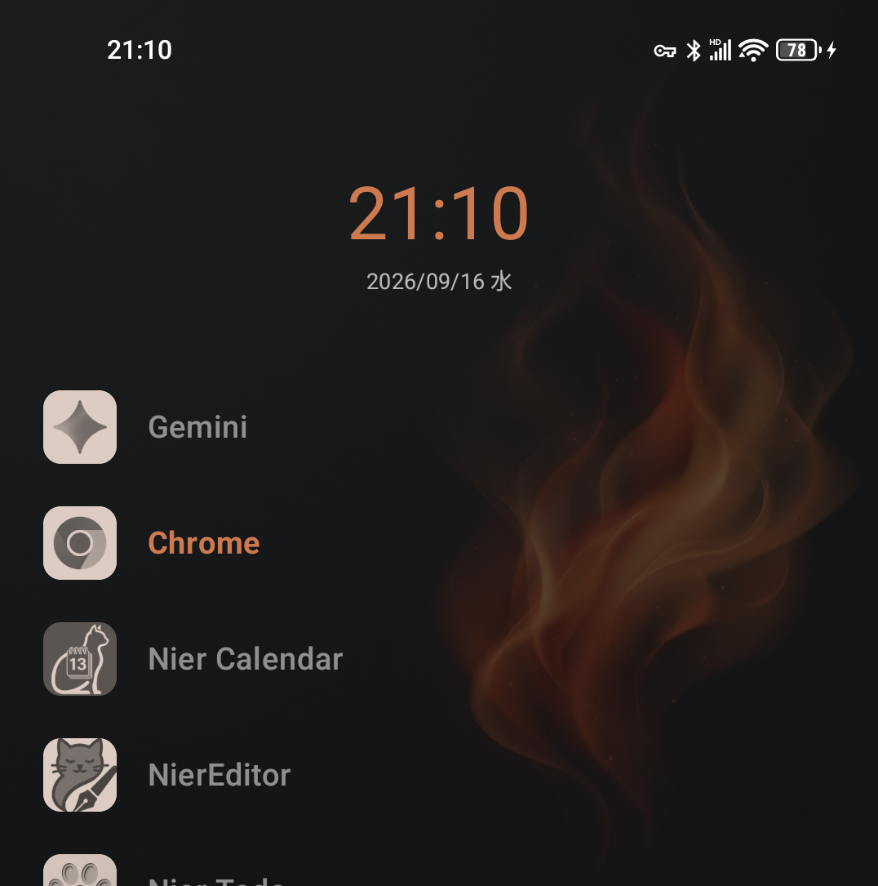
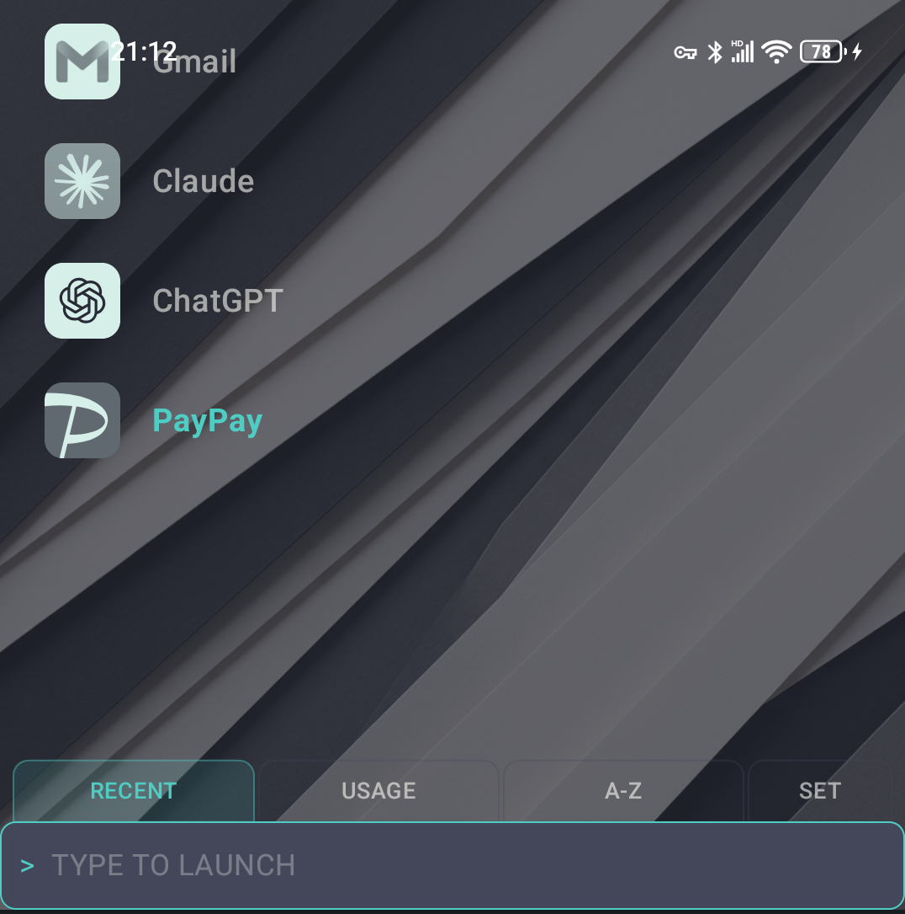
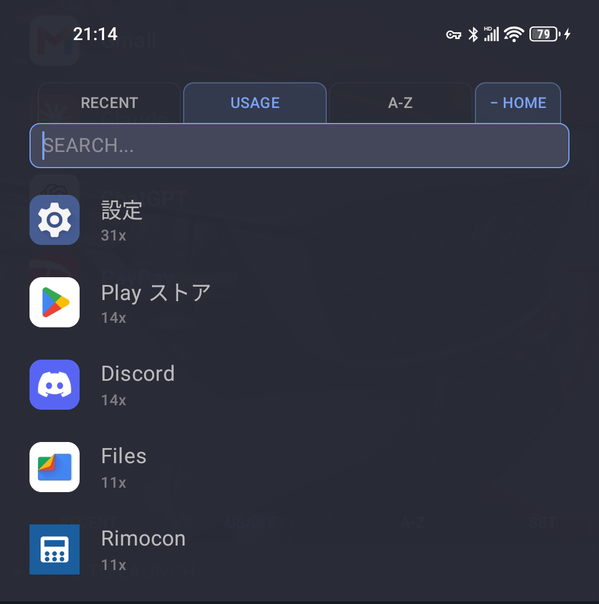

# NierLauncher

Android のホームアプリ（ランチャー）です。アイコンを並べたグリッドではなく、**縦一列のリスト**で
アプリを扱います。ホームにはよく使うアプリだけを置き、残りは検索で引き出します。

**このリポジトリは配布専用です。ソースコードは含まれていません。**
APK の置き場所として使っています。

| ホーム | タブと入力窓 | ALL APPS |
|---|---|---|
|  |  |  |

配色は 11 種から選べます。上の 3 枚はそれぞれ別のテーマと背景です。

## インストール

### 手動で入れる

1. [Releases](../../releases/latest) から `.apk` をダウンロード
2. 開くと「提供元不明のアプリ」の許可を求められるので、許可する
3. インストール
4. ホームキーを押すと、どのアプリをホームにするか聞かれるので NierLauncher を選ぶ

元のホームアプリに戻したいときは、Android の設定 → アプリ → デフォルトのアプリ → ホームアプリ
から切り替えられます。

### Obtainium で入れる（更新通知が届きます）

[Obtainium](https://github.com/ImranR98/Obtainium) を使うと、新しいバージョンが出たときに
通知が届き、そのまま更新できます。

1. Obtainium で「App」を追加
2. URL にこのリポジトリのアドレスを貼り付け
3. 追加

## 使い方

### ホーム画面

上に時計、その下によく使うアプリが縦に並びます。**ここに出るのはピン留めしたアプリだけ**です。
入れたばかりの状態では空なので、まず ALL APPS から何個か選んでホームに置いてください。

| 操作 | 動作 |
|---|---|
| アプリをタップ | 起動 |
| アプリを長押し → そのまま離す | メニュー（ホームから外す / Quick Launch / アンインストール） |
| アプリを長押し → 上下にドラッグ | 並べ替え |
| 時計・日付をタップ | 設定したアプリを起動（`CALENDAR APP`） |
| 時計のまわりの空白をタップ | Quick Launch の開閉 |

時計まわりの空白というのは、時計の上下左右の何も無いところです。時計の文字とそのすぐ周囲だけが
アプリ起動で、そこから外れると Quick Launch になります。

### 画面の行き来

上下の端で**引っぱる**と画面が切り替わります。勢いよくスクロールしただけでは反応せず、
指で引いたときだけ反応します。

| 場所 | 操作 | 行き先 |
|---|---|---|
| ホームの一番上 | 下に引く | Quick Launch |
| ホームの一番下 | 上に引く | ALL APPS |
| ALL APPS の一番上 | 下に引く | 閉じる |

ALL APPS には閉じるボタンがありません。**下に引いて閉じます**（戻るキーでも閉じます）。

### タブと入力窓

ホームのリストを一番下まで送ると、下から `RECENT` `USAGE` `A-Z` `SET` のタブがせり上がって
きます。ソートのタブを押すと、そのソートで ALL APPS が開きます。`SET` は設定です。

入力窓（`TYPE TO LAUNCH`）の出し方は 4 つから選べます（設定 → SYSTEM → `INPUT BAR`）。

| | 内容 |
|---|---|
| `AUTO` | 物理キーボードを繋いでいる時だけ出す（初期値） |
| `SHOW` | 常に出しておく |
| `TABS` | 普段は置かず、**タブと一枚の板になってせり上がってくる**。出た瞬間にカーソルが入るので、そのまま打ち始められます |
| `HIDE` | 出さない |

入力窓に打つと、1 文字目で ALL APPS に移ります。打った文字はそのまま引き継がれるので、
続けて打つだけで絞り込めます。Enter で先頭の候補が起動します。

物理キーボードの無い端末では `AUTO` のままだと入力窓が出ません。指で使う端末なら
`TABS` が扱いやすいはずです。

### Quick Launch

ホームの中でも特にすぐ出したいアプリを、横並びで最大 6 個まで置けます。設定やストア、電卓など、
「探すまでもないが、いつも使うわけでもない」ものの置き場です。

アプリを長押しして `[ ADD TO QUICK LAUNCH ]` で追加します。Quick Launch の中では、
長押しして横にドラッグすると並べ替えられます。

### ALL APPS

インストール済みのアプリがすべて出ます。**画面の上にタブと検索欄**があり、その下が一覧です。
ホームからせり上がってきた板が、そのまま上に持ち上がったような並びになっています。

**検索** — アプリ名だけでなく、**パッケージ名も一緒に検索します**。「マップ」でも `map` でも
同じアプリに辿り着けます（表示名は「マップ」、パッケージ名は `...apps.maps` のため）。
「天気」を `weather` で探すこともできます。アプリ名をうろ覚えのときに効きます。

当たった順は、完全一致 → 前方一致 → 部分一致 → パッケージ名、の順です。Enter で先頭が起動します。

**並び順**

| | 内容 |
|---|---|
| `RECENT` | 最後に起動した順 |
| `USAGE` | 起動した回数の多い順 |
| `A-Z` | 名前順 |

`RECENT` と `USAGE` は、**このランチャーから起動した実績**を数えています。導入直後は空なので、
使っていくうちに育ちます。

**`− HOME`** — ホームにピン留め済みのアプリを一覧から隠します。ホームで届くものを二重に
見たくないときに使ってください。

アプリを長押しすると、ホームへの追加・Quick Launch への追加・アンインストールのメニューが出ます。

### ダムフォンモード

アイコンも通知も色も無い、**文字だけの漆黒 2 画面**に切り替わります（設定 → SYSTEM → `DUMBPHONE`）。

- **1 枚目**：時計だけ。上か左に引くと 2 枚目へ
- **2 枚目**：許可したアプリの名前が縦に並ぶだけの一覧。戻るキーで 1 枚目へ

出てくるのは**自分で許可したアプリだけ**です。`＋ ADD APP` で足し、長押しして「外す」で減らし、
長押しドラッグで並べ替えます。何も許可していなければ、一覧は空のままです。

アプリ名の揃え（左 / 中央 / 右）と文字色（モノクロ / キーカラー）も選べます。

**システム全体の白黒化** — ダムモードに連動して、Android 全体をモノクロにできます。これには
`WRITE_SECURE_SETTINGS` 権限が必要で、実行時には取得できないため、一度だけ PC から
adb で付与します。

```
adb shell pm grant com.almco1.nierlauncher android.permission.WRITE_SECURE_SETTINGS
```

付与しない場合、白黒化だけが働きません（ダムモード自体は問題なく使えます）。adb を使わずに
白黒にしたい場合は、Android の設定 → ユーザー補助 → 色補正 → モノクロ を手動で切り替えて
ください（ショートカットに割り当てておくと楽です）。

### 設定

ホームのリストを一番下まで送って、右端の `SET` タブから開きます。
`APPEARANCE` `CLOCK` `SYSTEM` の 3 つに分かれています。

**APPEARANCE**

| | 内容 |
|---|---|
| `BASE SCHEME` | 配色（Default Dark, Tokyo Night, Dracula, Nord, Monokai, Solarized Dark, One Dark, Ayu Dark, GitHub Dark, セピアペーパー, ウォームクリーム の全 11 種） |
| `ACCENT COLOR` | アクセント色を自分で指定。指定するとテーマの色より優先されます。`システムを無彩色にする` を入れると時計やダイアログが白系になり、罫線の色が引き立ちます |
| `ICON COLOR` | アイコンをテーマ色の単色にする（バイカラー）か、元の色のまま出す（フルカラー）か |
| `VISUAL SURFACE` | 背景（NONE / SPLASH / MESH / CURVE / SLICE / FLAME の同梱 5 種、または `GALLERY` から自分の画像）。自分の画像は位置と拡大率を調整できます |
| `SYSTEM WALLPAPER` | いまの背景を端末の壁紙にも焼き込む。ロック画面そのものは差し替えられませんが、背景が揃うと時計の色まで寄ります |

端末やケースの色に合わせて配色を寄せられます。アイコンを単色にすると、色の情報が消えるぶん
文字だけで探すことになり、一覧の見え方がかなり変わります。

**CLOCK**

| | 内容 |
|---|---|
| `CLOCK FONT` | 時計の書体 |
| `CLOCK SIZE` | 時計の大きさ（S / M / L / XL） |
| `CALENDAR APP` | **時計をタップしたときに起動するアプリ**。カレンダーに限らず何でも指定できます |

`CALENDAR APP` を指定していない間は、時計の文字をタップしても Quick Launch が開きます。

**SYSTEM**

| | 内容 |
|---|---|
| `DUMBPHONE` | ダムフォンモード（前述） |
| `INPUT BAR` | 入力窓の出し方（前述） |
| `NOTIFICATION` | 通知バッジの表示。使うには通知アクセスの許可が必要です |
| `ABOUT` | オープンソースライセンスの表示 |

## 動作環境

| 項目 | 内容 |
|---|---|
| Android | 12 以降 (API 31+) |
| 確認済みの端末 | Unihertz Titan 2 Elite / Google Pixel 10a |

上記以外の端末では確認していませんが、特定の端末に依存した作りにはしていません。

## プライバシー

**このアプリはネットワークにアクセスしません。**

`INTERNET` 権限を持っていないため、どこかに何かを送ることは技術的に起こり得ません。
端末の設定画面からアプリの権限一覧を見ていただければ確認できます。

**インストールや起動のために許可を求める権限もありません。** 追加の許可が要るのは、
次の 2 つを使うときだけです。どちらも使わなければ求められません。

| 機能 | 必要なもの |
|---|---|
| 通知バッジ | 通知アクセスの許可（設定画面から任意で） |
| ダムモード連動の白黒化 | `WRITE_SECURE_SETTINGS`（adb から一度だけ） |

アプリの使用状況を読み取る `PACKAGE_USAGE_STATS` は使っていません。`RECENT` / `USAGE` の
並び順は、このランチャーから起動した回数をアプリ自身が数えたもので、端末内にのみ保存されます。

宣言している権限は次の 5 つだけです。

| 権限 | 用途 |
|---|---|
| `QUERY_ALL_PACKAGES` | アプリ一覧の取得（ランチャーの根幹） |
| `VIBRATE` | 操作時のハプティクス |
| `SET_WALLPAPER` | `SYSTEM WALLPAPER` で端末の壁紙に焼き込む |
| `REQUEST_DELETE_PACKAGES` | メニューからのアンインストール |
| `WRITE_SECURE_SETTINGS` | ダムモード連動の白黒化（adb で付与しない限り働きません） |

## 署名

配布している APK は下記の証明書で署名しています。ダウンロードした APK が本物か確かめたい
場合は、この指紋と照合してください。

```
CN=almco1, C=JP
SHA-256:
83:A0:91:A3:A4:3A:53:A3:54:D7:34:83:4E:84:68:80:
3E:AE:84:F6:9F:7A:6D:08:83:BE:80:DD:B1:9A:3C:4E
```

確認方法（Android SDK の build-tools に含まれています）:

```
apksigner verify --print-certs nierlauncher-x.y.z.apk
```

## ライセンス

アプリ本体は著作権を留保しています (All rights reserved)。

アプリが利用しているオープンソースソフトウェア (AndroidX, Jetpack Compose, Kotlin など) の
ライセンス表示は、アプリ内の **設定 → SYSTEM → ABOUT → OPEN SOURCE LICENSES** から
確認できます。
